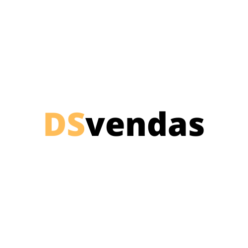
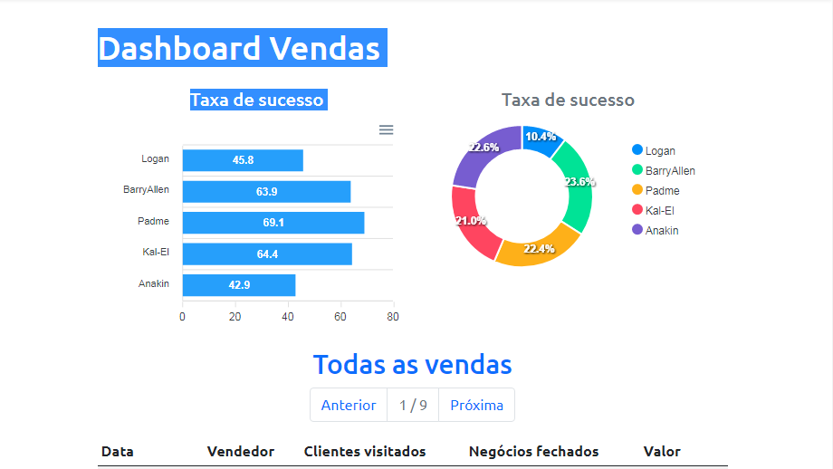

<h1 align="center">
  
</h1>

  <a href="#-tecnologias">Tecnologias</a>&nbsp;&nbsp;&nbsp;|&nbsp;&nbsp;&nbsp;
  <a href="#-projeto">Projeto</a>&nbsp;&nbsp;&nbsp;|&nbsp;&nbsp;&nbsp;
  <a href="#-layout">Layout</a>&nbsp;&nbsp;&nbsp;|&nbsp;&nbsp;&nbsp;
  <a href="#memo-licença">Licença</a>

 

  

 

  

## 🚀 Tecnologias

Esse projeto foi desenvolvido com as seguintes tecnologias:

- NextJS
- SpringBoot
- HTML
- SASS
- Bootstrap
- Typesript
- Java
- PostgreSQL 
- H2

## 💻 Projeto

Este projeto seria desenvolvido em REACTJS mas me desafiei a implementá-lo utilizando o framework NEXTJS. O DSVendas é uma aplicação de estimativa de cálculo de sucesso de vendas, onde é possível visualizar as taxas de sucesso em dois gráficos diferentes separando por vendedor e a taxa de sucesso individual. Além disso, é possível visualizar em uma tabela os dados individuais de cada venda pr dia 💰

## 🔖 Layout

Você pode visualizar o projeto funcionando através [desse link](https://gleydson-dsvendas-nextjs.netlify.app/).

---

Feito com ♥ by Gleydson durante o evento semana spring oferecido pela devsuperior :wave: [Participe da nossa comunidade!](https://discordapp.com/invite/gCRAFhc)

## Usabilidade

Para iniciar o projeto localmente use npm run dev